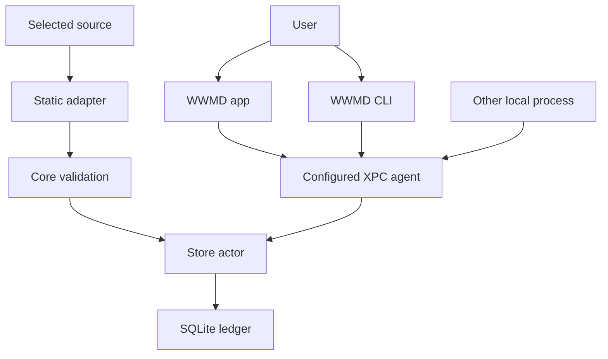

# WWMD Initial Threat Model

Status: implementation-grounded foundation review
Date: 2026-07-24
Scope: /Users/jmajor/projects/iamh2o/wwmd

## Assumption validation record

The user-supplied product contract establishes these operating assumptions:

- WWMD is a single-user, local-first macOS application with no cloud service,
  HTTP listener, or third-party executable plugin in V0.
- Telemetry may be private metadata and user-sensitive annotations, but V0
  excludes prompts, responses, source contents, titles, arguments, logs,
  environment values, clipboard, screen, key, and browser capture.
- The intended runtime has a signed app, agent, and CLI that communicate by
  native XPC; the exact release Team ID, entitlement, and distribution setup
  are not yet supplied.
- Codex CSV and live-source contracts are unavailable; the implementation must
  fail closed rather than discover or infer either source.

Open questions that would materially change risk ranking are the production
signing/App Group configuration, whether future sources require credentials,
and whether any team/network capability is proposed. This initial review keeps
those features out of scope and marks conclusions about them conditional.

## Executive summary

WWMD's highest risks are local telemetry privacy/integrity failures: a local
process spoofing the agent client boundary, a parser or source adapter
admitting content/secrets, and a mispackaged release weakening the intended
native XPC trust boundary. The current foundation has strong schema/field
validation, a single SQLite writer actor, an exact-contract CSV gate, an
explicit-root Git reader, native XPC server/client code that requires explicit
code-signing requirements, and a CLI that never opens the database. It does
not yet have a release-configured/running XPC service, security-scoped source
bookmarks/scheduling, managed deletion, or release-signing proof; those remain
high-priority implementation gates.

## Scope and assumptions

In scope: Package.swift; Sources/WWMDCore; Sources/WWMDStorage;
Sources/WWMDAdapters; Sources/WWMDAnalytics; Sources/WWMDIPC; Sources/wwmdd;
Sources/wwmd; Sources/WWMDApp; and docs/WWMD_AI_ENGINEERING_OBSERVABILITY_DESIGN.md.

Out of scope: predecessor repositories and historical databases, a production
Apple Developer signing account, actual Codex exports, cloud/network services,
CI hosting, and future team features. Existing WWMD source is a local
foundation, not a claim of a complete release daemon.

## System model

### Primary components

| Component | Role | Evidence anchor |
|---|---|---|
| WWMDCore | Closed event types, descriptor allowlists, provenance, privacy gate, identity, checkpoint contracts. | Sources/WWMDCore/TelemetryEvent.swift: JSONValue, PrivacyGate, TelemetryEventFactory. |
| WWMDStorage | Sole mutable SQLite/WAL access via actor, prepared statements, transactional migrations/checkpoints. | Sources/WWMDStorage/TelemetryStore.swift: TelemetryStore and SQLiteConnection. |
| WWMDAdapters | Explicit Git reader, safe activity/build/annotation offer constructors, and Codex exact-header gate. | Sources/WWMDAdapters/GitMetadataReader.swift and AdapterContracts.swift. |
| WWMDAnalytics | Pure association, metric, recommendation, and projection rebuilding. | Sources/WWMDAnalytics/CorrelationAndRules.swift: CorrelationEngine and ProjectionEngine. |
| WWMDIPC | Versioned typed XPC request/capability contract and native client. | Sources/WWMDIPC/XPCContract.swift and NativeXPCClient.swift. |
| WWMDAgentRuntime | Sole runtime mutation boundary, opt-in enforcement, and native XPC server. | Sources/WWMDAgentRuntime/WWMDAgentRuntime.swift and NativeXPCServer.swift. |
| wwmdd | Configured native-XPC agent executable and mutable database owner. | Sources/wwmdd/main.swift. |
| wwmd | Native-XPC-only CLI for safe read-only query/health responses. | Sources/wwmd/main.swift. |
| WWMDApp | Menu-bar/native viewer scaffold with explicit no-source state. | Sources/WWMDApp/main.swift. |

### Data flows and trust boundaries

- User -> WWMDApp: user settings/annotation intent through a native UI. The
  current scaffold deliberately displays configuration-required state rather
  than a fake local pause control; release behavior must use signed XPC.
- User-selected source -> static adapter: CSV headers or Git/build/activity
  metadata cross a parsing boundary. The runtime verifies explicit opt-in before
  it reads Git or invokes an explicit validation command; descriptor allowlists
  and pre-persistence filtering exist. Security-scoped bookmark scope and
  bounded scheduling queues are still required.
- Static adapter -> Core: SourceEventOffer crosses a validation boundary.
  PrivacyGate requires declared keys/provenance and rejects prohibited fields
  or common secret shapes before TelemetryEventFactory creates an event.
- Core -> TelemetryStore: validated immutable events and checkpoint cross a
  transactional persistence boundary. TelemetryStore serializes writes and
  only commits source progress with the event batch.
- App/CLI -> agent: XPCRequestEnvelope crosses the native XPC boundary. Both
  listener and client set explicit code-signing requirements, and the server
  additionally requires the same effective user. A production requirement and
  signed launchd proof remain absent.
- Agent -> export destination: safe NDJSON/CSV summary and SQLite backup are
  implemented for an explicit path, with checksummed receipts. Bookmark-backed
  managed paths and end-to-end deletion are not yet present.

#### Diagram

## Assets and security objectives

| Asset | Why it matters | Security objective |
|---|---|---|
| Telemetry event metadata | Can disclose work patterns, repositories, models, and sensitive user annotations. | Confidentiality and integrity. |
| Event provenance/redaction state | Determines whether a result is credible and privacy-safe. | Integrity. |
| Ledger, projections, and checkpoints | Drives summaries, recommendations, and safe replay. | Integrity and availability. |
| XPC capability/control plane | Controls collection, annotations, export, and deletion. | Integrity and confidentiality. |
| Source bookmarks and managed output paths | Can broaden filesystem exposure or identify sensitive locations. | Confidentiality and integrity. |
| Future credentials | Could permit source access if ever needed. | Confidentiality. |
| Release identity/signing configuration | Establishes whether a client is the intended app/CLI. | Integrity and confidentiality. |

## Attacker model

### Capabilities

- Another process running under the same logged-in macOS user can try to
  connect to a configured agent, modify local files it can access, feed a selected
  source malformed data, or exhaust local disk/CPU.
- A user-selected CSV can be malformed or adversarially crafted.
- A selected Git root can contain unexpected layout, moved worktrees, and
  metadata designed to stress parsers.
- A compromised or incorrectly packaged local app/CLI could attempt to use the
  agent's privileged storage capability.

### Non-capabilities

- No remote unauthenticated network attacker reaches WWMD V0 because it has no
  network listener or cloud service by design.
- No cross-user or cross-tenant attacker is modeled; the initial product is one
  local user.
- No third-party native plugin is loaded by V0; adapter code is statically
  linked per Package.swift and V0AdapterDescriptors.

## Entry points and attack surfaces

| Surface | How reached | Trust boundary | Notes | Evidence |
|---|---|---|---|---|
| SourceEventOffer | Static adapter to Core | Source metadata to trusted model | Must have allowed fields and provenance before event creation. | Sources/WWMDCore/TelemetryEvent.swift: SourceEventOffer and PrivacyGate. |
| Codex CSV header | User-selected import | File to adapter | Exact header order/contract required; no generic parser mapping. | Sources/WWMDAdapters/AdapterContracts.swift: CodexCSVImportGate. |
| SQLite database | Agent writer | Process to local durable data | Actor and prepared statements exist; same-user file tamper is still a residual risk. | Sources/WWMDStorage/TelemetryStore.swift: TelemetryStore. |
| Migration fixture/schema | Database open | Existing data to new schema | Atomic transactions and schema checks; historic migrations need continued coverage. | Sources/WWMDStorage/TelemetryStore.swift: migrate. |
| XPC request data | App/CLI agent call | Local client to agent | Typed capability/range validation, explicit listener/client code-signing requirements, and same-user acceptance exist; release signing proof is absent. | Sources/WWMDIPC and Sources/WWMDAgentRuntime/NativeXPCServer.swift. |
| CLI arguments | User/automation to CLI | Local command to product | CLI accepts explicit XPC configuration and safe query scopes; it never opens/scans the DB. | Sources/wwmd/main.swift. |
| Menu-bar actions | User to app | Native UI to configured agent | The scaffold reports configuration-required state and does not fake a local persisted pause. | Sources/WWMDApp/main.swift. |

## Top abuse paths

1. A local process attempts to impersonate WWMD.app to a configured agent, invokes
   control/delete operations, and changes collection or data. Impact: ledger
   integrity/privacy loss. Required stop: native listener/client
   code-signing-requirement validation before request decode.
2. A crafted CSV declares benign headers but inserts huge/malformed rows or
   unexpected content into a permitted field. Impact: denial of service or
   leaked content. Required stop: exact contract, row/byte caps, strict typed
   decoder, PrivacyGate, and quarantine receipt.
3. A selected repository root contains a symlink escape and causes the Git
   adapter to inspect outside the approved scope. Impact: local metadata
   disclosure. Current stops: canonical root validation and no broad scan.
   Required expansion: security-scoped bookmark handling and scheduling scope.
4. A source field includes a token-looking value or title/prompt-like field.
   Impact: secret/content persistence or export. Current stop: prohibited field
   fragments/secret prefix rejection in PrivacyGate; required expansion:
   redaction tests and bounded error logging.
5. A process locks the database or floods an adapter with events. Impact:
   collection loss or resource pressure. Current partial stop: one actor,
   SQLite busy timeout and transactions; required stop: queue/disk quotas and
   production backpressure.
6. A release package has the wrong Team ID or entitlement policy, so an
   intended signed-peer check is absent. Impact: local client spoofing. Required
   stop: SEC-001 release artifact verification; no unsigned fallback.
7. An export/diagnostic bundle includes private annotations or a raw payload.
   Impact: data disclosure. Current stop: safe export excludes user-sensitive
   events and uses checksummed receipts. Required expansion: managed path
   receipt, preview, and fixture secret scan.

## Threat model table

| Threat ID | Threat source | Prerequisites | Threat action | Impact | Impacted assets | Existing controls (evidence) | Gaps | Recommended mitigations | Detection ideas | Likelihood | Impact severity | Priority |
|---|---|---|---|---|---|---|---|---|---|---|---|---|
| TM-001 | Same-user local process | Release agent publishes a Mach service. | Spoof app/CLI and request control/query/delete. | Read/inject/delete telemetry. | XPC control plane, ledger. | XPC request validation plus explicit listener/client code-signing requirements and same-user delegate check exist in Sources/WWMDIPC and Sources/WWMDAgentRuntime/NativeXPCServer.swift. | Release Team ID/entitlement/Mach-service configuration is not proven. | Supply a release designated requirement, test signed peer accept/reject, and reject unsigned/mismatch. | Redacted peer rejection count and code-sign verification result. | Medium | High | high |
| TM-002 | Malformed CSV | User selects a file after contract is supplied. | Exhaust parser or inject bad metadata. | Availability/integrity/privacy. | Agent, ledger, telemetry. | Exact header contract requires non-empty matching headers. | No streaming parser/row cap yet. | Stream with row/byte/batch caps, typed conversion, quarantine digest only, fuzz parser. | Adapter health, rejected row count, bounded queue depth. | Medium | Medium | medium |
| TM-003 | Selected repo metadata | Git adapter is enabled for an explicit configuration. | Use symlink/move/repository shape to read beyond root. | Metadata disclosure. | Local paths/repository metadata. | Runtime checks opt-in before reading; Git reader resolves symlinks, requires exact root, invokes fixed Git arguments, and stores only hashed repo ID/aggregates. | Bookmark scope and scheduling/rotation handling absent. | Validate security-scoped bookmark and canonical child paths; reject escapes. | Root digest/reason-code health event. | Medium | High | high |
| TM-004 | Source or annotation input | Allowed payload field reaches Core. | Persist prompt/title/secret-shaped value. | Content/secret disclosure. | Telemetry/exports/diagnostics. | PrivacyGate rejects prohibited fragments, common secret prefixes, nested payloads, and free-text/non-opaque metadata identifiers in Sources/WWMDCore/TelemetryEvent.swift. | Pattern coverage and export/diagnostic filtering incomplete. | Keep closed descriptors; add regression corpus, redacted logs, export profile tests. | Quarantine counts only; no raw input logs. | Medium | High | high |
| TM-005 | Same-user process/file mutation | Process can access local storage path. | Tamper ledger/WAL or managed output. | Incorrect evidence/data loss. | Ledger/projections/receipts. | SQLite transactions, integrity check, one writer actor, checksummed export/backup receipts in Sources/WWMDStorage/TelemetryStore.swift. | No at-rest cryptographic tamper proof or managed path provenance. | App Group permissions, integrity checks, verified managed backups, visible tamper state. | quick_check result, backup checksum mismatch. | Medium | Medium | medium |
| TM-006 | Local client/event flood | Adapter/XPC runtime exists. | Force expensive query/write/retry loops or fill disk. | Availability. | Agent, disk, responsiveness. | XPC range/metric/page caps, agent query result cap, actor writer, and opt-in-before-source execution. | Queue/disk quotas and scheduled retry limits are missing. | Enforce byte/record queues, disk reserve, cancellation, fixed query CPU budget. | Queue depth, disk class, rate-limited rejection counters. | Medium | Medium | medium |
| TM-007 | Build/package substitution | Distribution pipeline/runtime exists. | Replace binary or misconfigure signing. | Agent boundary bypass. | Signing/XPC trust. | Static targets, no direct-DB CLI, explicit native code-signing requirements. | No release signing/notarization verification. | Pin release requirement, verify Team ID/entitlements in integration test, notarize. | Release artifact audit receipt. | Low | High | high |
| TM-008 | Export/diagnostic action | Export is invoked. | Cause user-sensitive content to be emitted by default. | Data disclosure. | Annotations/metadata. | Safe export excludes user-sensitive events, records checksum/profile, and has regression tests. | No bookmark-backed managed path, preview, or secret-scan coverage. | Redaction profile, explicit annotation toggle, preview, manifest checksum, tests. | Export receipt/profile and secret-scan test evidence. | Medium | High | high |
| TM-009 | Database migration input | Existing V1 database or altered schema. | Cause partial schema/data loss on upgrade. | Availability/integrity. | Ledger/projections. | Transactional migration and V1-to-latest fixture in Sources/WWMDStorage and Tests/WWMDStorageTests. | Future migrations need equivalent fixtures and backup preflight. | One transaction/migration, checksum/preflight, backup-first forward incompatibility handling. | Migration version/checksum and rollback receipt. | Low | Medium | medium |
| TM-010 | Rule/source drift | Model/source changes after V0. | Mislead user through stale price/rule/mapping semantics. | Decision integrity. | Metrics/recommendations. | Rule and projection versions are explicit in Sources/WWMDAnalytics. | Price table/import and recommendation state persistence absent. | Effective-dated local prices, rule activation version, coverage gate, data-gap rule. | Stale-source/rule coverage status. | Medium | Medium | medium |

## Criticality calibration

- critical: remote unauthenticated compromise, cross-user access, or arbitrary
  code execution from normal V0 use. No such reachable remote surface is in
  scope; a future network listener or plugin would require reassessment.
- high: same-user local process can bypass XPC identity, persist content/secrets,
  or export sensitive telemetry silently. TM-001, TM-003, TM-004, TM-007, and
  TM-008 are high because impact is privacy/integrity loss.
- medium: bounded local denial of service, local tampering that integrity checks
  can reveal, migration failure, or stale metrics. TM-002, TM-005, TM-006,
  TM-009, and TM-010 fall here.
- low: non-sensitive metadata display defects or a rejected request with no
  persistence. Examples include a malformed safe CLI query, a generic
  health-message formatting issue, and a disabled source descriptor.

## Focus paths for security review

| Path | Why it matters | Related Threat IDs |
|---|---|---|
| Sources/WWMDCore/TelemetryEvent.swift | Field allowlist, prohibited content/secret detection, provenance, event construction. | TM-002, TM-004 |
| Sources/WWMDStorage/TelemetryStore.swift | SQLite write, migration, checkpoint, integrity, export/backup, and retention boundary. | TM-005, TM-006, TM-009 |
| Sources/WWMDAdapters | Exact CSV gate plus explicit Git/build/activity source normalization. | TM-002, TM-003, TM-004 |
| Sources/WWMDIPC | Capability/version boundary and native client signing requirement. | TM-001, TM-006, TM-007 |
| Sources/WWMDAgentRuntime/NativeXPCServer.swift | Agent peer requirement, same-user delegate check, and XPC service dispatch. | TM-001, TM-006, TM-007 |
| Sources/wwmdd/main.swift | Agent executable ownership/lifecycle and configured XPC service start. | TM-001, TM-005, TM-006 |
| Sources/wwmd/main.swift | Must remain a no-direct-DB client. | TM-001, TM-007 |
| Sources/WWMDApp/main.swift | Privacy state visibility and future destructive action confirmation. | TM-001, TM-008 |
| Tests/WWMDStorageTests/TelemetryStoreTests.swift | Migration/idempotency/checkpoint regression proof. | TM-005, TM-009 |
| docs/WWMD_AI_ENGINEERING_OBSERVABILITY_DESIGN.md | Frozen threat/privacy/process decisions that implementation must not silently weaken. | TM-001 through TM-010 |

## Notes on use

This threat model is a foundation checkpoint, not a release sign-off. It covers
all current runtime entrypoints, the planned source/XPC/export boundaries, and
separates current code controls from design requirements. Security acceptance
remains blocked on signed XPC peer verification, production packaging,
security-scoped source selection/scheduling, managed deletion, and a
release-build security test receipt.
